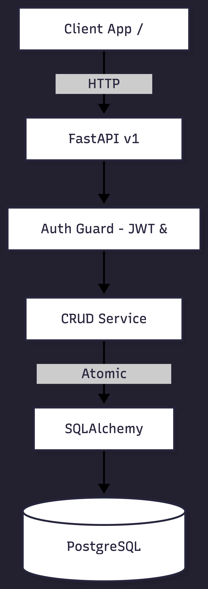

# Campaign Management API v1.0

[](https://github.com/your-username/campaign-management-api/actions)
[](https://www.python.org/)
[](https://fastapi.tiangolo.com/)

A production-oriented FastAPI backend platform designed for managing marketing campaigns, executing task coordination, enforcing Role-Based Access Control (RBAC), and maintaining mutation audit logs.

## Domain Context
Before transitioning into backend engineering, I managed marketing operations across consumer brands—handling multi-team approval pipelines, tight launch deadlines, and client deliverables. Real-world marketing workflows depend on strict state management and auditability. I built this system to translate operational realities into a structured, secure backend engine.

## System Architecture


```text
  [ Client Application / Postman ]
                 │
                 ▼
         ┌───────────────┐
         │ FastAPI v1    │  <── Request ID Tracing (X-Request-ID) & CORS
         └───────┬───────┘
                 │
                 ▼
         ┌───────────────┐
         │ Auth Guard    │  <── OAuth2 + JWT Expiration Checks & RBAC
         └───────┬───────┘
                 │
                 ▼
         ┌───────────────┐
         │ CRUD Services │  <── Single-Transaction Log Mutations & Task Rules
         └───────┬───────┘
                 │
                 ▼
         ┌───────────────┐
         │ SQLAlchemy    │  <── Composite Indexes & Connection Pooling
         └───────┬───────┘
                 │
                 ▼
         ┌───────────────┐
         │  PostgreSQL   │
         └───────────────┘
